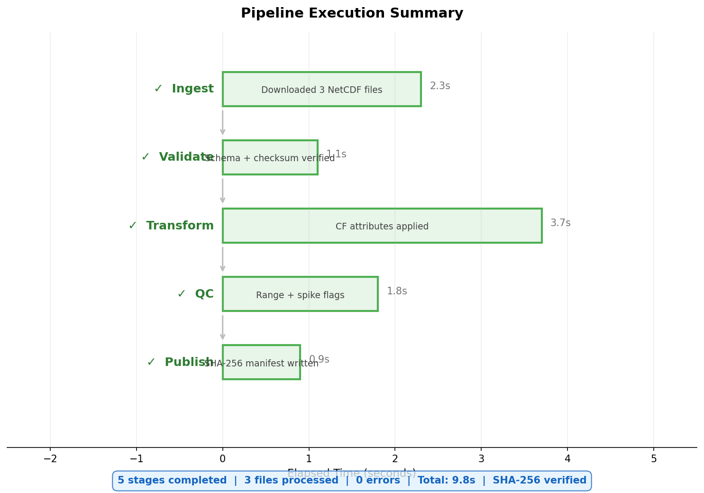
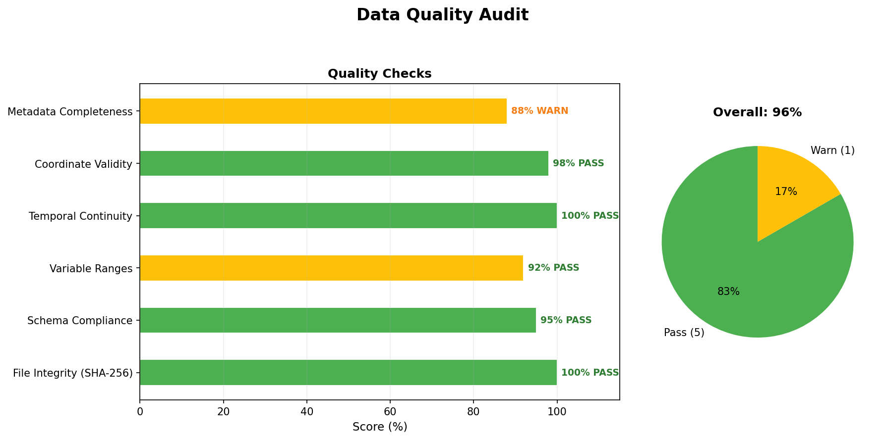

# ocean-curation-pipeline-toolkit

[](https://github.com/ranjithguggilla/ocean-curation-pipeline-toolkit/actions)
[](https://www.python.org/downloads/)
[](LICENSE)
[]()
[]()

A Python/Bash pipeline that transforms raw oceanographic datasets into
FAIR-compliant, archive-ready submission packages for scientific data repositories.





**Problem:** Principal investigators submit data as ad-hoc Excel files and
CSVs with inconsistent formatting, no metadata, and no integrity checks.
Curators spend hours per submission cleaning, documenting, and packaging.

**Solution:** This toolkit automates the curation workflow end-to-end —
from messy raw files to a FAIR-compliant package with ISO 19115-2 metadata,
CF-1.8 NetCDF exports, SHA-256 checksums, data quality profiles, and a
complete provenance trail.

## Pipeline

```
init → validate → transform → profile → checksum → metadata → netcdf → package
```

| Step | What it does | Key output |
|------|-------------|------------|
| `init` | Create versioned submission scaffold, copy raw files | `manifest.json` |
| `validate` | Check encoding, structure, ranges, duplicates | `validation_report.json` |
| `transform` | Normalize headers, timestamps, coordinates | Cleaned CSVs + provenance log |
| `profile` | Variable statistics, outlier detection, quality grade | `DATA_QUALITY_REPORT.md` |
| `checksum` | SHA-256 hashes for every file | `checksums.sha256` |
| `metadata` | ISO 19115-2 XML with auto-detected extent | `iso19115-2.xml` |
| `netcdf` | CF-1.8 compliant NetCDF-4 with standard names | `.nc` files |
| `package` | FAIR audit, README, CHANGELOG, tar.gz archive | Submission-ready package |

## Quick Start

```bash
# Clone and install
git clone https://github.com/ranjithguggilla/ocean-curation-pipeline-toolkit.git
cd ocean-curation-pipeline-toolkit
pip install -e ".[dev]"

# Generate sample data (optional — included in repo)
python sample_data/generate_samples.py

# Run the full pipeline
./run.sh

# Or run individual steps
ocean-curation-pipeline -c config.yaml init
ocean-curation-pipeline -c config.yaml validate
ocean-curation-pipeline -c config.yaml transform
ocean-curation-pipeline -c config.yaml profile
ocean-curation-pipeline -c config.yaml checksum
ocean-curation-pipeline -c config.yaml metadata
ocean-curation-pipeline -c config.yaml netcdf
ocean-curation-pipeline -c config.yaml package
```

## Output Structure

```
output/submission_v1.0.0/
├── raw/                          # Original files (untouched)
│   ├── GOMECC4_cruise_...xlsx
│   └── station_log.csv
├── processed/                    # Cleaned, normalized CSVs
│   ├── gomecc4_cruise_...csv
│   └── station_log.csv
├── netcdf/                       # CF-1.8 NetCDF-4 exports
│   ├── gomecc4_cruise_...nc
│   └── station_log.nc
├── metadata/
│   └── iso19115-2.xml            # ISO 19115-2 geospatial metadata
├── docs/
│   ├── README.md                 # Dataset README
│   ├── DATA_QUALITY_REPORT.md    # Quality profile with statistics
│   └── config_snapshot.yaml      # Exact config used
├── logs/
│   ├── processing.log            # Full execution log
│   ├── provenance.jsonl          # JSON Lines audit trail
│   ├── validation_report.json    # Per-check pass/fail
│   ├── transform_summary.json    # Transformation provenance
│   ├── data_quality_profile.json # Machine-readable quality stats
│   ├── netcdf_export.json        # CF mapping report
│   └── metadata_validation.json  # XML validation result
├── manifest.json                 # File inventory with sizes/hashes
├── checksums.sha256              # SHA-256 fixity manifest
├── FAIR_AUDIT.md                 # 15-point FAIR self-assessment
├── CHANGELOG.md                  # Version history
└── submission_v1.0.0.tar.gz      # Compressed archive
```

## Standards Compliance

| Standard | Implementation |
|----------|---------------|
| **ISO 19115-2:2009** | Jinja2-rendered XML, XSD-validated |
| **CF Conventions 1.8** | Standard name mapping for NetCDF variables |
| **ACDD 1.3** | NetCDF global attributes auto-populated |
| **FAIR Principles** | 15-point self-audit report |
| **SHA-256** | BSD-format checksum manifest |
| **ISO 8601** | Timestamp normalization |
| **EPSG:4326** | Coordinate reference validation |

## Sample Data

The included sample simulates a GOMECC-4 Gulf of Mexico cruise with
intentional quality issues: mixed date formats, whitespace artifacts,
missing values, duplicate rows, and non-standard headers. These mirror
real-world problems encountered during oceanographic data curation.

See `sample_data/generate_samples.py` for documentation of each
intentional issue.

## Configuration

All pipeline behavior is controlled by `config.yaml`. Key sections:

- **`dataset`** — Title, abstract, DOI, contact, spatial/temporal coverage, keywords
- **`files`** — Input file paths, formats, sheet names
- **`quality`** — Required columns, value ranges, duplicate key columns
- **`transform`** — Header normalization, timestamp format, NA representation
- **`metadata`** — Platform, instruments, lineage, processing steps

## Testing

```bash
pytest -v                   # Run all tests
pytest --cov=ocean_curator    # With coverage
```

## Documentation

- **[METHODS.md](docs/METHODS.md)** — Full technical methods report
- **[notebooks/pipeline_walkthrough.ipynb](notebooks/pipeline_walkthrough.ipynb)** — Interactive walkthrough
- **[PROJECT_BLUEPRINT.md](PROJECT_BLUEPRINT.md)** — Architecture and build guide

## Requirements

- Python 3.10+
- Bash 4+ (for `run.sh`)
- Dependencies: pandas, lxml, jinja2, netCDF4, xarray, click, pyyaml,
  chardet, openpyxl

## License

MIT — see [LICENSE](LICENSE)

## Author

**Ranjith Guggilla**
